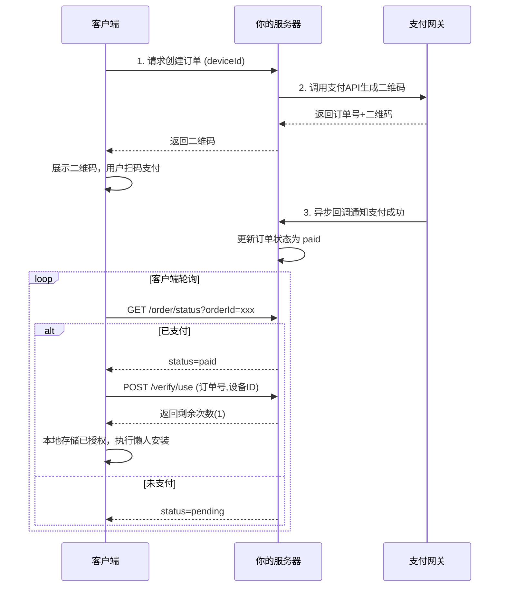
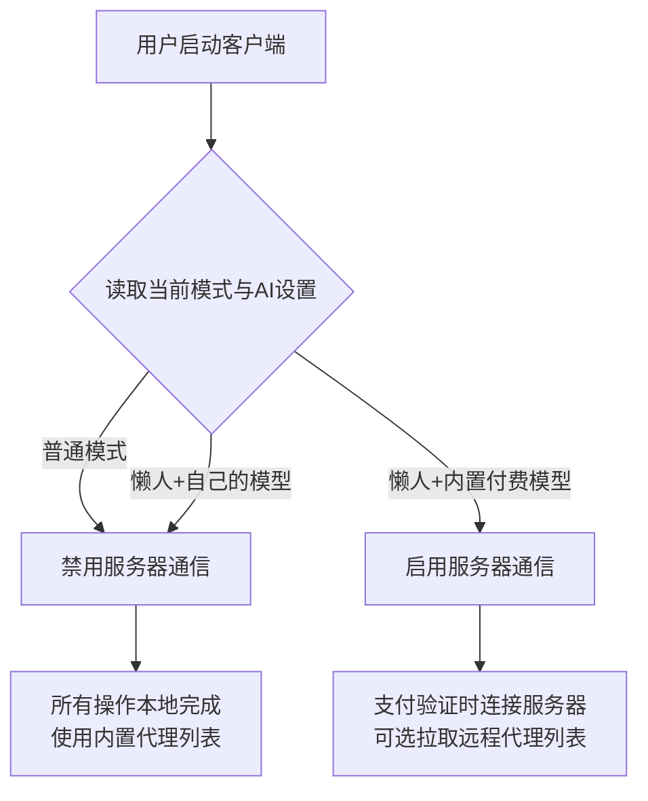

收到，这是一个需要重构的Electron+React项目，涉及搜索、GitHub代理下载、AI辅助安装、支付授权等模块。我将为你提供一份完整的设计方案，详细分解各模块的实现思路。

---

**一、整体架构设计**

**1.1 技术栈选型**
- **Electron主进程**: 负责文件操作、系统调用、IPC通信、下载管理、支付状态轮询
- **渲染进程**: React 18 + TypeScript + Vite
- **UI组件库**: Ant Design (成熟、组件丰富) 或 Mantine (更现代、轻量)
- **状态管理**: Zustand (轻量、简单) 或 Jotai
- **IPC通信**: Electron的 `ipcMain` / `ipcRenderer`
- **本地加密存储**: `electron-store` + `crypto` (AES-256)
- **打包工具**: `electron-builder` (支持多平台，配置灵活)

**1.2 目录结构**

```
project/
├── electron/
│   ├── main.ts           # 主进程入口
│   ├── preload.ts        # 预加载脚本（暴露安全的API）
│   ├── ipc/              # IPC处理模块
│   │   ├── search.ts     # 搜索相关（GitHub API + 本地模糊匹配）
│   │   ├── download.ts   # 下载相关（源码/release，代理）
│   │   ├── install.ts    # 懒人安装（调用AI+执行命令）
│   │   ├── payment.ts    # 支付授权（订单处理、本地加密记录）
│   │   └── settings.ts   # 设置存储
│   └── utils/            # 工具函数（加密、系统信息、GitHub代理）
├── renderer/
│   ├── src/
│   │   ├── components/   # React组件
│   │   ├── pages/        # 页面（主界面、设置页）
│   │   ├── store/        # Zustand状态
│   │   └── App.tsx
│   └── index.html
├── resources/            # 图标等资源
└── build/               # 打包配置
```

**1.3 数据存储**
- **文件**: `~/.myapp/data.db` (加密的JSON，使用`electron-store`，`encryptionKey`从设备ID派生)
- **关键字段**:
  - `deviceId`: 设备唯一标识（UUID，首次启动生成）
  - `orders`: `[{ orderId, timestamp, status, usedAt? }]`
  - `logs`: 数组，最多保留50条最近加密日志（每条约500字节，总大小<25KB）
  - `settings`: 用户配置（AI模型参数、代理地址）

---

**二、GitHub国内代理下载方案**

**2.1 代理服务选择**
- **源码下载**: 替换域名 `github.com` → `hub.fastgit.xyz` 或 `ghproxy.net`
- **Release下载**: 使用 `https://ghproxy.net/https://github.com/{owner}/{repo}/releases/download/{tag}/{asset}`

**2.2 实现要点**

```typescript
// electron/utils/githubProxy.ts
export function getProxyUrl(originalUrl: string): string {
  const proxy = 'https://ghproxy.net/';
  return proxy + originalUrl;
}

// 自动选择release包
function getAssetForCurrentPlatform(assets: Asset[]): Asset | null {
  const platformMap = {
    win32: { arch: process.arch, pattern: /windows|win32|\.exe$/i },
    darwin: { arch: process.arch, pattern: /macos|darwin|\.dmg$/i },
    linux: { arch: process.arch, pattern: /linux/i }
  };
  // 匹配逻辑...
}
```

- 使用`axios` + `progress-stream`实现下载进度
- 失败重试3次，切换备用代理（如`gitclone.com`）

---

**三、懒人安装AI集成**

**3.1 工作流程**
1. 用户输入GitHub URL → 克隆/下载到临时目录
2. 扫描`README.md`、`package.json`、`setup.py`等
3. 准备提示词给AI模型：包含项目结构、文件内容片段、要求输出安装命令序列
4. AI返回命令列表（如`npm install`, `python setup.py`, `make`等）
5. 按顺序执行，每步检查退出码；失败时询问用户是否重试/跳过/终止
6. 记录日志（加密存储）

**3.2 AI模型集成**
- **内置模型**: 使用`@xenova/transformers`加载轻量级代码模型（如`CodeGen-350M`），但体积较大（~600MB），首次下载需时间
- **推荐方案**: 用户配置OpenAI兼容API（本地Ollama、DeepSeek、OpenAI等），代码中预留`/v1/chat/completions`接口调用
- **提示词模板**:

```
  根据以下项目信息，生成在{os}系统上安装该项目的命令序列（每行一个命令）。
  项目根目录文件列表：{files}
  关键文件内容摘要：{readme_snippet}
  只输出命令，不要解释。
  ```

**3.3 安全沙箱**
- 限制AI生成的命令不得包含`rm -rf /`、`sudo`等高危操作
- 执行前展示命令让用户确认（可设置自动信任模式）
- 使用`child_process`的`exec`，设置超时和输出大小限制

---

**四、无登录支付授权机制**

**4.1 核心思路**
- **设备绑定**: 首次启动生成`deviceId`（UUID），本地存储
- **订单生成**: 用户选择“懒人安装” → 调用支付网关API生成订单（金额2.99元），返回支付二维码
- **状态轮询**: 客户端每2秒查询订单状态，支付成功后下载回执
- **激活验证**: 支付成功后，客户端将`orderId` + `deviceId`签名后发送到你的服务器验证（可选），或完全本地校验（若订单数据通过支付网关回调签名验证）
- **本地记录**: 加密存储已使用的订单号，每次懒人安装前检查剩余次数
- **售后**: 用户输入订单号可恢复使用次数（需联网验证订单有效性）

**4.2 支付网关推荐**
- **聚合支付**: PayJs、虎皮椒（提供统一下单接口，支持微信/支付宝，生成二维码）
- **自行集成**: 支付宝当面付（费率低但需企业资质）、微信支付Native（需商户号）

**4.3 本地加密存储结构**

```typescript
interface PaymentRecord {
  orderId: string;
  deviceId: string;
  usedAt?: number;      // 使用时间戳，null表示未使用
  createdAt: number;
}
```

- 每次启动时检查是否有未使用的订单，计数剩余次数
- 使用`crypto.createCipheriv`加密，密钥从`deviceId`派生

---

**五、前端React UI设计方案**

**5.1 组件划分**
- `SearchBar`: 输入框 + 类型切换(URL/关键词) + 星标排序开关
- `ResultList`: 展示项目列表（虚拟滚动优化），点击项目触发README加载
- `ReadmeViewer`: 使用`react-markdown`渲染，自定义`a`标签的`onClick`在内部WebView中导航（类似浏览器）
- `ModeSelector`: 普通模式/懒人模式切换
- `DeployPathInput`: 输入框 + 文件选择按钮（IPC调用`dialog.showOpenDialog`）
- `SettingsModal`: 配置AI模型、代理、支付相关参数
- `LogViewer`: 滚动显示安装日志

**5.2 状态管理 (Zustand)**
```typescript
interface AppState {
  searchType: 'url' | 'keyword';
  query: string;
  results: Project[];
  selectedProject: Project | null;
  mode: 'normal' | 'lazy';
  deployPath: string;
  logs: string[];
  paymentRemaining: number;
  settings: Settings;
}
```

**5.3 关键交互流程**
1. **搜索**: 用户输入 → 防抖300ms → 主进程调用GitHub API（代理）或本地模糊匹配 → 更新结果列表
2. **查看README**: 点击项目 → 根据项目url获取README（代理加速） → Markdown渲染 → 内部链接通过`onClick`阻止跳转，加载新内容到同一面板
3. **执行安装**: 选择模式 → 点击“安装” → 主进程处理（普通模式下载/解压；懒人模式检查支付剩余次数，调用AI）→ 实时推送日志到渲染进程

---

**六、多平台兼容注意事项**

- **路径处理**: 使用`path.join`和`app.getPath('userData')`获取用户数据目录
- **文件选择器**: 主进程`dialog.showOpenDialog`，返回路径给渲染进程
- **系统命令差异**: Windows用`cmd`或`powershell`，Linux/macOS用`bash`；AI生成命令前告知OS类型
- **打包配置**: `electron-builder`的`win`、`mac`、`linux`目标，注意签名和notarization

---

**七、后续开发建议**

1. **原型验证优先**: 先实现普通模式的搜索+下载+README查看，再逐步集成AI和支付
2. **支付走沙箱环境**: 支付宝/微信支付都有沙箱，测试通过后再上线
3. **代码开源部分**: 支付模块可单独提取为闭源插件，主程序开源
4. **日志加密**: 使用`crypto`库，密钥通过用户提供的密码派生（用户可选设置密码保护日志）


当代理加速链接随时可能失效时，需要一套动态发现和故障转移机制。以下是针对你的Electron+React项目的实现方案。

---

**加速源管理：核心策略：多源 + 健康检查 + 自动切换**

**1. 候选代理源维护**

维护一个内置的候选列表，并支持从远程配置更新：

```typescript
// electron/utils/proxyManager.ts
const DEFAULT_PROXIES = [
  'https://ghproxy.net',
  'https://mirror.ghproxy.com',
  'https://gh.api.99988866.xyz',
  'https://gh.ddlc.top',
  'https://github.moeyy.xyz',
  'https://git.886.beer',
  'https://gh-proxy.com'
];

// 远程配置URL（你自己维护，可随时更新可用列表）
const REMOTE_PROXY_LIST_URL = 'https://your-server.com/api/gh-proxies';
```

**2. 健康检查与可用性探测**

启动时或定期（如每12小时）对所有代理进行测速，选出最快且可用的：

```typescript
async function testProxySpeed(proxyUrl: string): Promise<number | null> {
  const testUrl = `${proxyUrl}/https://raw.githubusercontent.com/.../test.txt`;
  const start = Date.now();
  try {
    const res = await fetch(testUrl, { method: 'HEAD', signal: AbortSignal.timeout(5000) });
    if (res.ok) return Date.now() - start;
    return null;
  } catch {
    return null;
  }
}

async function refreshAvailableProxies(): Promise<string[]> {
  const results = await Promise.all(
    DEFAULT_PROXIES.map(async (proxy) => {
      const latency = await testProxySpeed(proxy);
      return { proxy, latency, available: latency !== null };
    })
  );
  return results
    .filter(r => r.available)
    .sort((a, b) => a.latency! - b.latency!)
    .map(r => r.proxy);
}
```

**3. 带故障转移的下载函数**

实际下载时，依次尝试已排序的代理，直到成功：

```typescript
async function downloadWithFallback(url: string, destPath: string): Promise<void> {
  const availableProxies = await getAvailableProxies(); // 从缓存或实时探测
  for (const proxy of availableProxies) {
    const proxyUrl = `${proxy}/${url}`;
    try {
      await downloadFile(proxyUrl, destPath);
      return; // 成功
    } catch (err) {
      console.warn(`Proxy ${proxy} failed:`, err.message);
      continue;
    }
  }
  throw new Error('All proxies failed');
}
```

**4. 动态远程更新**

为了应对所有内置代理同时失效，提供一个远程配置端点，你可以在服务端随时更新有效代理列表：

```typescript
async function fetchRemoteProxyList(): Promise<string[]> {
  try {
    const res = await fetch(REMOTE_PROXY_LIST_URL, { signal: AbortSignal.timeout(3000) });
    const data = await res.json();
    return data.proxies || [];
  } catch {
    return [];
  }
}

async function getAvailableProxies(): Promise<string[]> {
  // 合并远程列表和默认列表，去重
  const remote = await fetchRemoteProxyList();
  const all = [...new Set([...DEFAULT_PROXIES, ...remote])];
  // 测试速度并返回可用列表（缓存结果，避免每请求都测速）
  return testAndCache(all);
}
```

**5. 用户可覆盖的代理设置**

在设置界面允许用户手动指定自定义代理，优先级最高：

```typescript
interface Settings {
  customProxy?: string;      // 用户手动输入的代理
  proxyMode: 'auto' | 'custom';
}
```

---

**进阶方案：使用像 `gh-proxy` 这样的自托管代理**

如果用户有服务器资源，可以建议用户自建代理（如 `gh-proxy`），然后填入自定义代理地址，永久稳定。

---

**总结优点**

- **自动故障转移**：第一个代理失效自动切下一个
- **性能最优**：根据延迟排序，默认用最快的
- **远程配置**：无需更新客户端即可刷新代理列表
- **用户可控**：支持自定义代理和切换模式

这样即便某个加速链接失效，客户端仍能自动找到可用的替代链接，保证下载功能持续可用。

---

**收费与日志记录的补充设计**

**1. 核心逻辑**

```typescript
// 在启动懒人安装前检查
function canUseLazyInstall(): { allowed: boolean; reason?: string } {
  // 1. 如果用户配置了自定义模型（OpenAI兼容API，且非空Key/地址）
  if (settings.aiProvider !== 'builtin' && settings.aiApiKey && settings.aiBaseUrl) {
    return { allowed: true }; // 免费，无需付款检查
  }

  // 2. 如果使用内置模型，检查本地是否有未使用的支付订单
  const remainingCount = getRemainingPaidUses(); // 从加密存储读取
  if (remainingCount > 0) {
    return { allowed: true };
  }
  return { allowed: false, reason: '需要支付 2.99 元以使用内置模型懒人安装' };
}
```

**2. 安装日志记录策略**

- 场景: 用户配置了自己的模型（免费） | 是否记录日志: ? 不记录 | 是否加密: N/A | 日志用途: 无需求
- 场景: 使用内置模型 + 已支付 2.99元 | 是否记录日志: ? 记录 | 是否加密: ? 加密 | 日志用途: 仅用于退款时核实安装过程

- **加密密钥**：从设备ID + 订单号派生，只有用户本地可解密（用于用户自己提给客服验证）。
- **日志内容**：执行命令序列、每步输出摘要、错误堆栈（最多 50KB/次）。
- **保留时长**：保留最近 3 次支付的日志，超出自动删除最旧。

**3. 退款验证流程**

- 用户联系客服（提供订单号）。
- 用户导出本地加密日志（点击“导出日志”按钮，生成一个 zip 文件，内含 `.log.enc` 和 `.key` 文件，或使用订单号作为密码的加密包）。
- 客服使用内部工具解密验证安装失败事实，决定是否退款。

**4. 前端界面调整**

在“设置” -> “AI 模型”中：
- 选项：`内置模型（需付费）` / `自定义模型（免费）`
- 自定义模型需填写：`API地址`、`API Key`、`模型名称`
- 提示文案：*“使用自定义模型不收取任何费用，且不会记录安装日志（保护隐私）”*

---

**服务器架构设计**

**1. 服务器角色与职责**

- 功能模块: 订单生成与支付回调 | 描述: 调用支付网关API创建订单，接收微信/支付宝异步通知，更新订单状态 | 是否必须: ? 必须
- 功能模块: 订单验证接口 | 描述: 客户端验证订单是否有效（防止本地篡改） | 是否必须: ? 必须
- 功能模块: 设备绑定与恢复 | 描述: 支持用户凭订单号恢复使用次数（重装系统后） | 是否必须: 推荐
- 功能模块: 动态代理列表下发 | 描述: 定期更新可用的GitHub加速代理列表 | 是否必须: 推荐
- 功能模块: 日志上传与客服支持 | 描述: 用户可上传加密日志供退款核验 | 是否必须: 可选

**2. 技术选型**

- **运行时**：Node.js (Express) 或 Python (FastAPI) — 轻量、部署方便
- **数据库**：SQLite (轻量) 或 PostgreSQL (如需高并发)
- **支付网关集成**：
  - 聚合支付：PayJs、虎皮椒（提供统一API，自动生成二维码）
  - 官方直连：支付宝当面付、微信支付Native（需商户资质）
- **部署方式**：
  - 低成本：Vercel Serverless Functions + Supabase (免费额度)
  - 自建：2核2G云服务器 + Docker (约50元/月)

**3. API端点设计**

**3.1 订单相关**

```
POST /api/order/create
请求体: { deviceId: string, amount: 2.99 }
返回: { orderId, qrcode_url, expire_time }

POST /api/order/webhook   (支付网关回调)
接收支付异步通知，更新订单状态为 paid

GET /api/order/status?orderId=xxx&deviceId=xxx
返回: { status: "pending" | "paid" | "expired" }
```

**3.2 验证与恢复**

```
POST /api/verify/use
请求体: { orderId: string, deviceId: string }
返回: { valid: true, remainingUses: 1 }   # 每笔订单仅可验证一次，验证后标记已使用

POST /api/restore
请求体: { orderId: string, newDeviceId: string }   # 用于重装系统后恢复
返回: { success: true, message: "已绑定新设备" }
```

**3.3 代理列表**

```
GET /api/proxy/list
返回: { proxies: ["https://ghproxy.net", "https://mirror.ghproxy.com", ...], version: 2 }
```

**4. 数据库表结构 (SQLite)**

```sql
CREATE TABLE orders (
    id TEXT PRIMARY KEY,           -- 订单号
    device_id TEXT NOT NULL,       -- 首次绑定的设备ID
    amount INTEGER DEFAULT 299,    -- 分
    status TEXT DEFAULT 'pending', -- pending/paid/used/expired
    paid_at DATETIME,
    used_at DATETIME,
    restored_device_id TEXT,       -- 重装后新设备ID
    created_at DATETIME DEFAULT CURRENT_TIMESTAMP
);

CREATE TABLE proxy_list (
    version INTEGER PRIMARY KEY,
    proxies TEXT,                  -- JSON数组
    updated_at DATETIME
);
```

**5. 与客户端交互流程**



**6. 安全措施**

- **订单防重放**：每个订单号只能被同一设备验证一次，验证后标记`used`
- **设备绑定**：首次验证时记录`device_id`，恢复时需原设备ID验证或人工审核
- **签名验证**：支付网关回调需验证签名，防止伪造
- **限流**：同一IP/设备每分钟最多创建3个订单，防止滥用

**7. 部署建议**

1. **开发测试**：使用`ngrok`暴露本地服务器接收支付回调
2. **生产环境**：部署到Vercel + Supabase（一键Git推送）
3. **后台管理**：简单Admin界面查看订单、手动恢复用户权限

---
**核心设计：按需连接策略**

**1. 连接触发条件判定**

- 用户选择的模式: 普通模式（下载源码/release） | 使用的模型: 无关 | 是否需要连接服务器: ? **不需要**
- 用户选择的模式: 懒人安装模式 | 使用的模型: 用户自己的模型（免费） | 是否需要连接服务器: ? **不需要**
- 用户选择的模式: 懒人安装模式 | 使用的模型: 内置模型（付费 2.99 元） | 是否需要连接服务器: ? **需要**（支付验证、订单状态）

**2. 客户端实现**

```typescript
// electron/utils/connectionManager.ts
export function isServerRequired(mode: 'normal' | 'lazy', aiProvider: string): boolean {
  if (mode === 'normal') return false;
  if (mode === 'lazy' && aiProvider !== 'builtin') return false; // 自己配置的模型
  return true; // 懒人安装 + 内置付费模型
}

// 在启动时或切换设置时检查
function updateNetworkAccess() {
  const needServer = isServerRequired(settings.mode, settings.aiProvider);
  if (!needServer) {
    // 禁用所有向你的服务器发起的请求
    // 可以设置一个全局标志，所有 API 调用前检查
    globalThis.__DISABLE_SERVER_REQUESTS__ = true;
  } else {
    globalThis.__DISABLE_SERVER_REQUESTS__ = false;
  }
}
```

**3. API 请求拦截**

所有向你的后端服务器发出的请求都经过一个统一函数：

```typescript
async function callServerAPI(endpoint: string, data?: any) {
  if (globalThis.__DISABLE_SERVER_REQUESTS__) {
    throw new Error('当前模式无需连接服务器，已自动阻止网络请求');
  }
  // 正常请求逻辑...
}
```

**4. 动态代理列表的特殊处理**

代理列表用于 GitHub 加速下载，无论是否连接服务器都可能需要。但可以分层：

- **内置默认代理列表**：始终可用，离线也能工作
- **远程代理列表**（从你的服务器获取）：仅在需要服务器时才会拉取，是一个**可选的优化**。如果用户离线或不需要服务器，就用内置列表。

```typescript
async function getProxyList() {
  if (globalThis.__DISABLE_SERVER_REQUESTS__) {
    return DEFAULT_PROXIES; // 只用内置，不联网
  }
  try {
    const remote = await fetchRemoteProxyList(); // 尝试获取更新的
    return [...new Set([...DEFAULT_PROXIES, ...remote])];
  } catch {
    return DEFAULT_PROXIES;
  }
}
```

**5. 前端 UI 提示**

在设置界面，当用户选择“普通模式”或“自己的模型”时，可以显示一条提示：

> ? 当前模式无需联网，所有操作均在本地完成，不会连接任何服务器。

**6. 服务器侧影响**

- 服务器只在用户使用**内置付费模型**时才会被访问
- 订单验证、支付回调、设备恢复等接口只在此时被调用
- 代理列表接口是可选的辅助功能，即使不调用也不影响基础功能

**7. 流程图**

